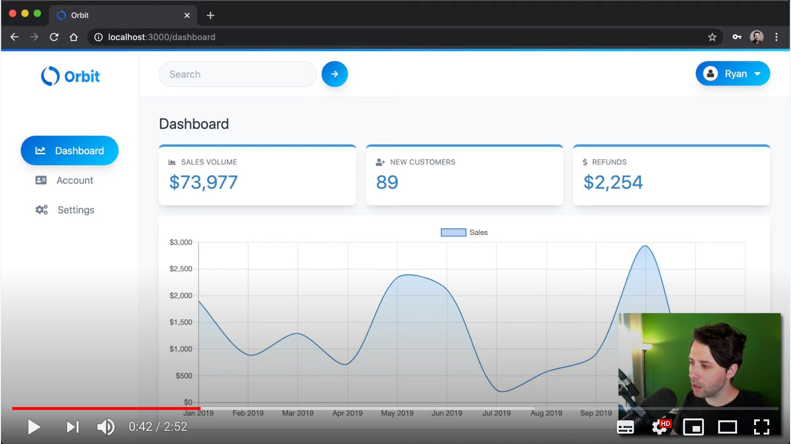

# ReactSecurity - Orbit App with Auth0 and GraphQL

<p>
  <a href="https://twitter.com/ryanchenkie" target="_blank">
    
  </a>
</p>

👋 Welcome to Orbit! This is a demo app for learning security for React applications. You can find out more at [ReactSecurity.io](https://reactsecurity.io).

## A Look at the App

Here's the dashboard for the app


For a more in-depth tour, check out this video:

[](https://www.youtube.com/watch?v=cTAizIOENZw)

There are two parts to the app in this project: **orbit-app** and **orbit-api**. These are the front end React application and the backend Node API respectively.

## Install the Dependencies

We need to install dependencies for both **orbit-app** and **orbit-api**. Change directories into each and install with **npm** or **yarn**.

With **npm**:

```bash
cd orbit-app
npm install
cd ../orbit-api
npm install
```

With **yarn**:

```bash
cd orbit-app
yarn
cd ../orbit-api
yarn
```

## Set Up the Environment Files

### Front End

The React app contains a file called `.env.local.example`. Make a copy of this file and call it `.env.example`. When you start the app, the variables in this file will be picked up and used to configure your Auth0 instance.

The variables in this file are as follows:

- `REACT_APP_GRAPHQL_URI`
- `REACT_APP_AUTH0_DOMAIN`
- `REACT_APP_AUTH0_CLIENT_ID`
- `REACT_APP_AUTH0_AUDIENCE`
- `REACT_APP_JWT_NAMESPACE`

You can leave `REACT_APP_GRAPHQL_URI` as is, unless you plan to serve your GraphQL API over a different address/port. The other variables are particular to your Auth0 account and you can find them in your application record in the "Applications" tab in the Auth0 dashboard.

The variable for `REACT_APP_JWT_NAMESPACE`, however, won't be found in your Auth0 dashboard. This is a value that you need to set yourself in the Auth0 rule that is used for this example.

Here's the example rule that I use for this demo app:

```js
function (user, context, callback) {
  const namespace = 'https://app.orbit/';
  context.idToken[namespace + 'roles'] = context.authorization.roles;
  context.accessToken[namespace + 'sub'] = user.orbit_id;
  return callback(null, user, context);
}
```

You'll need to set up a rule like this in your own Auth0 account. You can do so by navigating to the "Rules" tab in the Auth0 dashboard and clicking "Create Rule".

**NOTE:** The value for `user.orbit_id` comes from the user's `app_metadata`. This can be found in the user's profile in Auth0. I manually put this value there and it's an ID that corresponds to the user from the Mongo database.

### Backend

The backend contains a file called `.env.example`. This file needs to be renamed to `.env` and provided with values.

For `ATLAS_URL`, provide the connection string to your MongoDB Atlas cluster. You can use other MongoDB providers, or even use a local MongoDB connection. Learn how to create a MongoDB instance with Atlas [here](https://www.mongodb.com/download-center).

The values for `AUTH0_DOMAIN` and `AUTH0_AUDIENCE` come from the API record that you create in your Auth0 account. You can create an API record by navigating to the "APIs" section in your Auth0 dashboard.

The value for `AUTH0_JWT_NAMESPACE` should match the namespace you set up in the Auth0 rule above.

## Run the Applications

The React app is built with **create-react-app**. Run it with the script provided in its **package.json** file.

```bash
cd orbit-app
npm start
```

The Node API comes with a script in its `package.json` which allows you to run it in development mode with **nodemon**.

Open a new terminal window, change directories into the API, and start it up.

```bash
cd orbit-api
npm run dev
```

The Node API will be running at `http://localhost:3001`.

Navigate to `http://localhost:3000` to see the app running!

## License

MIT
